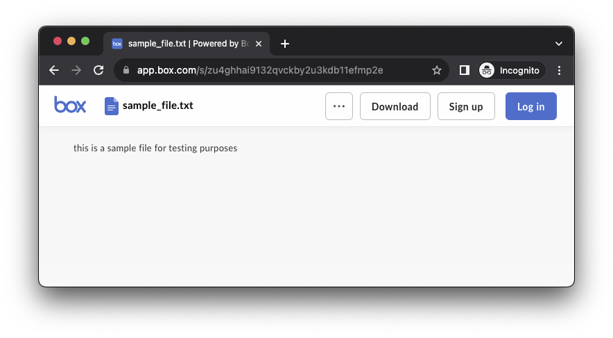
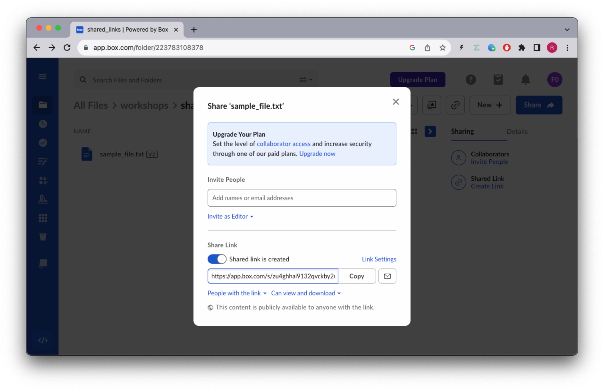
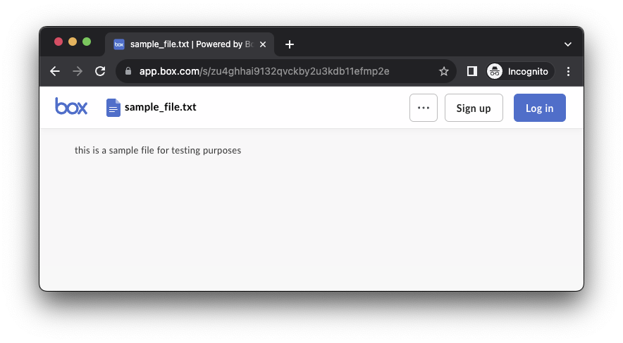
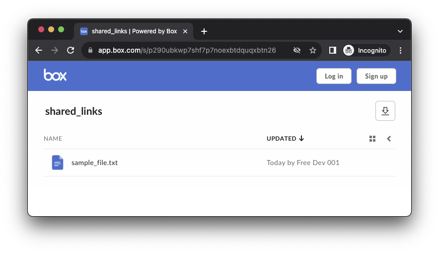
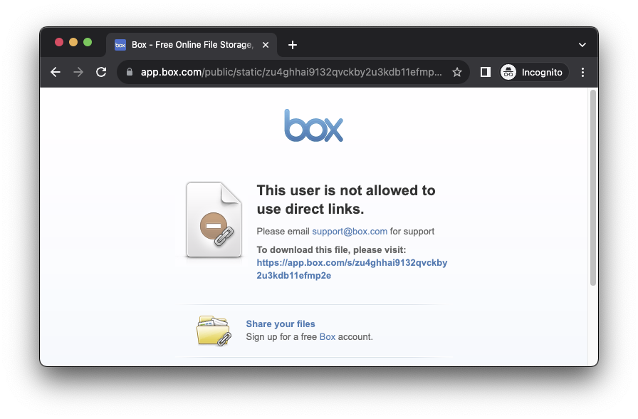

# Shared Links
Shared links are URLs that are generated for files, folders, web links stored in Box, which provide direct access to the resource.

Users can access shared items by entering the shared link URL in a browser. Applications can also access shared items using the Shared Item API.


## Concepts
Shared links have an `access level` which represents the typ of user tha can access the item:
* `open` - Anyone with the link can access the item
* `company` - Only users in the same enterprise can access the item
* `collaborators` - Only collaborators who have explicitly associated can access the item

Shared links have permissions which determine what actions can be performed on the item:
* `can_download` - The item can be downloaded
* `can_preview` - The item can be previewed
* `can_edit` - The item can be edited (files only)

Items can only have a single shared link at a time.

## Shared Links API
References to our documentation:
* [SDK Files](https://github.com/box/box-python-sdk/blob/main/docs/usage/files.md#create-a-shared-link-download-url)
* [SDK Folders](https://github.com/box/box-python-sdk/blob/main/docs/usage/folders.md#create-or-update-a-shared-link)
* [API Guide](https://developer.box.com/guides/shared-links/)
* [API Reference Files](https://developer.box.com/reference/get-shared-items/)
* [API Reference Folders](https://developer.box.com/reference/get-folders-id--get-shared-link/)


# Exercises
## Setup
Create a `shared_links_init.py` file on the root of the project and execute the following code:
```python
"""create sample content to box"""
import logging
from utils.config import AppConfig

from utils.box_client import get_client

from workshops.shared_links.create_samples import create_samples

logging.basicConfig(level=logging.INFO)
logging.getLogger("boxsdk").setLevel(logging.CRITICAL)

conf = AppConfig()


if __name__ == "__main__":
    client = get_client(conf)
    create_samples(client)

```
Result:
```
INFO:root:      Folder workshops (223095001439)
INFO:root:      Folder shared_links (223783108378)
INFO:root:      File uploaded sample_file.txt (1293174201535)
```

Next, create a `shared_links.py` file on the root of the project that you will use to write your code.
Create a global constant named `SHARED_LINKS_ROOT` and make it equal to the id of the `shared_links` folder, in my case `223783108378`
Create a global constant named `SAMPLE_FILE` and make it equal to the id of the `sample_file.txt` file, in my case `1293174201535`

```python
"""Box Shared links"""

from enum import Enum
import logging
from boxsdk import Client

from boxsdk.object.file import File
from boxsdk.object.folder import Folder
from boxsdk.object.item import Item

from utils.config import AppConfig
from utils.box_client import get_client

logging.basicConfig(level=logging.INFO)
logging.getLogger("boxsdk").setLevel(logging.CRITICAL)

conf = AppConfig()

SHARED_LINKS_ROOT = "223783108378"
SAMPLE_FILE = "1293174201535"


def main():
    """Simple script to demonstrate how to use the Box SDK"""
    client = get_client(conf)

    user = client.user().get()
    print(f"\nHello, I'm {user.name} ({user.login}) [{user.id}]")


if __name__ == "__main__":
    main()
```


## Create a shared link for a file
Create a method that creates adn return a shared link for a file.
```python
class SharedLinkAccess(str, Enum):
    OPEN = "open"
    COMPANY = "company"
    COLLABORATORS = "collaborators"


def file_shared_link(
    file: File,
    access: SharedLinkAccess,
) -> str:
    return file.get_shared_link(access=access.value)
```
Then use it in your main method:
```python
def main():
    ...

    file = client.file(SAMPLE_FILE).get()
    shared_link_file = file_shared_link(file, SharedLinkAccess.OPEN)
    print(f"\nShared link for {file.name}: {shared_link_file}")

```
Resulting in:
```
Hello, I'm Free Dev 001 (barduinor+001@gmail.com) [25428698627]

Shared link for sample_file.txt: https://app.box.com/s/zu4ghhai9132qvckby2u3kdb11efmp2e
```
Now try to open an incongnito window and paste the link, you should be able to download the file.


Then in an ormal browser window open box.com, navigate to the `/workshops/shared_links` and click the shared link icon on the file.




## Implementing permissions
Update the `file_shared_link` method to accept the `permissions` parameters.
```python
def file_shared_link(
    file: File,
    access: SharedLinkAccess,
    allow_download: bool = None,
    allow_preview: bool = None,
    allow_edit: bool = None,
) -> str:
    return file.get_shared_link(access=access.value)
```
And let's make a new request to create a shared link with that only allows viewing.
```python
def main():
    ...

    shared_link_view = file_shared_link(
        file, SharedLinkAccess.OPEN, allow_download=False, allow_preview=True, allow_edit=False
    )
    print(f"\nShared link for {file.name}: {shared_link_view}")
```
Resulting in:
```
Hello, I'm Free Dev 001 (barduinor+001@gmail.com) [25428698627]

Shared link for sample_file.txt: https://app.box.com/s/zu4ghhai9132qvckby2u3kdb11efmp2e

Shared link for sample_file.txt: https://app.box.com/s/zu4ghhai9132qvckby2u3kdb11efmp2e
```

Note that the shared link utl did not change, and if you refresh your incongnito browser, the download button should ddisapeer.


## Create a shared link for a folder
Let's implement the same functionality for folders.
The `company` access level is only available to paid accounts.
The `allow_download` can only be used if the `access` is `open` or `company`

```python
def folder_shared_link(
    folder: Folder,
    access: SharedLinkAccess,
    allow_download: bool = None,
    allow_preview: bool = None,
) -> str:
    return folder.get_shared_link(access=access.value, allow_download=allow_download, allow_preview=allow_preview)
```
Test this by creating a shared link for the `SHARED_LINKS_ROOT` folder.
```python
def main():
    ...

    folder = client.folder(SHARED_LINKS_ROOT).get()
    shared_link_folder = folder_shared_link(folder, SharedLinkAccess.OPEN)
    print(f"\nShared link for {folder.name}: {shared_link_folder}")
```
Resulting in:
```
Hello, I'm Free Dev 001 (barduinor+001@gmail.com) [25428698627]

Shared link for sample_file.txt: https://app.box.com/s/zu4ghhai9132qvckby2u3kdb11efmp2e

Shared link for sample_file.txt: https://app.box.com/s/zu4ghhai9132qvckby2u3kdb11efmp2e

Shared link for shared_links: https://app.box.com/s/p290ubkwp7shf7p7noexbtdquqxbtn26
```
Again test the folder shared link on your incognito browser:


## Downloadable shared link
Files also have a direct download shared link url, which can be used to download the file directly.
Update your main method to print the download url for the file.
```python
def main():
    ...

    url = file.get_shared_link_download_url(access=SharedLinkAccess.OPEN.value)
    print(f"\nDownload URL for {file.name}: {url}")
```
Resulting in:
```
Hello, I'm Free Dev 001 (barduinor+001@gmail.com) [25428698627]

Shared link for sample_file.txt: https://app.box.com/s/zu4ghhai9132qvckby2u3kdb11efmp2e

Shared link for sample_file.txt: https://app.box.com/s/zu4ghhai9132qvckby2u3kdb11efmp2e

Shared link for shared_links: https://app.box.com/s/p290ubkwp7shf7p7noexbtdquqxbtn26

Download URL for sample_file.txt: https://app.box.com/shared/static/zu4ghhai9132qvckby2u3kdb11efmp2e.txt
```
Now you can open this last url in your incognito browser and the file will be downloaded directly.
If you get an error similar to:

This is a configuration your Box admin can set that affects the general configuration.
If you're using a free account you will not be able to change these options.

## Item from Shared Link
We can find out what object type and id a shared link is pointing to.
Let's create a method to do this:
```python
def item_from_shared_link(client: Client, url: str, password: str = None) -> Item:
    return client.get_shared_item(url, password=password)
```
And test it in your main method:
```python
def main():
    ...

    item_a = item_from_shared_link(client, shared_link_file)
    print(f"\nItem from shared link: {item_a.name} is a {item_a.type} ({item_a.id})")

    item_b = item_from_shared_link(client, shared_link_folder)
    print(f"\nItem from shared link: {item_b.name} is a {item_b.type} ({item_b.id})")
```
Resulting in:
```
Item from shared link: sample_file.txt is a file (1293174201535)

Item from shared link: shared_links is a folder (223783108378)
```

## Extra Credit
There are a few more things you can do with shared links:
* Create a method to remove a shared link
* Update the `file_shared_link` method to accept the `password`, `unshared_at`, and `vanity_name` parameter
* Update the `folder_shared_link` method to accept the `password`, `unshared_at`, and `vanity_name` parameter
* Create a method that accepts a shared link url and downloads the item if it is a file.

# Final thoughts
Shared links are a great way to share content with users that are not part of your enterprise.
They can also be used to share content with users that are part of your enterprise without concerns if the share link end up in the hands of the wrong audience..


